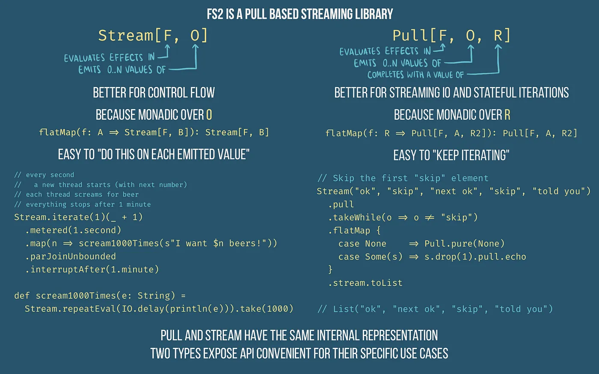

# FS2-Examples

In general you want to ask for the least powerful kind of function; `A=>B, A=>F[B], A=>Stream[F, B]`, etc 
for Kafka, `Chunk[A] => F[Chunk[B]] or Chunk[A] => F[Unit]` are optimal 

The right association ensures that the operations are composed in a way that is efficient and stack-safe.

Recursive Operations and Stack Safety:
Recursive operations, especially when dealing with monads, have the potential to cause stack overflow errors if not implemented carefully.

Each recursive call consumes space on the call stack, and if the recursion goes too deep, it can lead to a stack overflow.
Tail Recursion and Right Association:
Right association is crucial for achieving tail recursion, which is a technique that allows certain recursive functions to be optimized by the Scala compiler.
Tail-recursive functions are designed so that the recursive call is the last operation in the function, making it compatible with optimizations like tail call optimization (TCO).
Trampolining for Stack Safety:
In scenarios where direct tail recursion is not possible, trampolining can be employed to achieve stack safety. Trampolining involves using a loop to repeatedly apply functions until the final result is reached.
Right association facilitates trampolining by ensuring that the recursive calls are performed in a way that avoids stack buildup.

rampolining is a technique used in functional programming to achieve stack safety when dealing with potentially deep recursion. In Scala, this is particularly relevant when working with recursive monadic operations or other recursive functions that might otherwise lead to a stack overflow.


Free Monads and Trampolining:
Trampolining is often used in conjunction with the concept of Free Monads. Free Monads provide a way to build complex, domain-specific languages by representing computations as a data structure. Trampolining can be applied to make the interpretation of Free Monad structures stack-safe.

Trampolining is closely related to Continuation Passing Style (CPS), where functions take an additional argument representing the continuation of the computation. While not always the same, trampolining often involves transforming a recursive function into CPS to achieve stack safety.

Unordered means that we don't care about the order of results from the evalMap action.


It allows for higher throughput because it never waits to start a new job. It has N job permits (with a semaphore), and the moment one job finishes, it requests the next element from the stream and begins operation.


Contramap is essentially the opposite of map. While map operates on the "output" or "result" of a computation, contramap works on the "input" or "parameter" of a computation

```scala
trait Printable[A] {
  def format(value: A): String

  def contramap[B](f: B => A): Printable[B] =
    (value: B) => format(f(value))
}

```

## Pull 
  The output values of a pull are emitted not one by one, but in chunks.
  A `Chunk` is an immutable sequence with constant-time indexed lookup. For example,a pull `p: Pull[F, Byte, R]` internally operates and emits `Chunk[Byte]` values, which can wrap unboxed byte arrays -- avoiding boxing/unboxing costs.The `Pull` API provides mechanisms for working at both the chunk level and the individual element level. Generally, working at the chunk level will result in better performance but at the cost of more complex implementations

  A pull only emits non-empty chunks.

  However, chunks are not merely an operational matter of efficiency. Each pull is emitted from a chunk atomically, which is to say, any errors or interruptions in a pull can only happen between chunks, not within a chunk. For instance, if creating a new chunk of values fails (raises an uncaught exception) while creating an intermediate value, then it fails to create the entire chunk and previous values are discarded.

```scala
Pull[F[_],+O,+R]
```
- Reads values from one or more streams
- returns a result of type R
- and produces a `Stream[F,O]` when calling `stream` method


In Haskell `uncons` is used to Decompose a list into its head and tail.
If the list is empty, returns Nothing.
If the list is non-empty, returns Just (x, xs), where x is the head of the list and xs its tail.
 ```scala
 uncons []
 //Nothing

 uncons [1]
 //Just (1,[])
 uncons [1, 2, 3]
 //Just (1,[2,3])

 ```

the library implements the Stream type functions using the Pull type 

The `Pull[F[_], O, R]` type represents a program that can pull output values of type `O` while computing a result of type `R` while using an effect of type `F`

The result `R` represents the information available after the emission of the element of type `O` that should be used to emit the next value of a stream. For this reason, using `Pull` directly means to develop recursive programs

The `Pull` type represents a stream as a head and a tail, much like we can describe a list. The element of type `O` emitted by the `Pull` represents the head. However, since a stream is a possible infinite data structure, we cannot express it with a finite one. So, we return a type `R`, which is all the information that we need to compute the tail of the stream.
We can convert a `Pull` having the `R` type variable bound to Unit directly to a `Stream` by using the `stream` method

 A `Pull` that returns Unit is like a List with a head and empty tail.
 Unlike the `Stream` type, which defines a monad instance on the type variable `O`, a `Pull` forms a monad instance on `R`. If we think, it’s logical: All we want is to concatenate the information that allows us to compute the tail of the stream.

 we can convert a `Stream` into a `Pull` using the `echo` method:
```scala
Stream(7).pull.echo// convert a Stream to a Pull
```
 Another way to convert a `Stream` into a `Pull` is to use the `uncons` function, which returns a `Pull` pulling a tuple containing the head chunk of the stream and its tail


```scala
 implicit final class StreamPullOps[F[_], O](private val self: Pull[F, O, Unit]) extends AnyVal {
private[fs2] def uncons: Pull[F, Nothing, Option[(Chunk[O], Pull[F, O, Unit])]] =
      self match {
        case Succeeded(_)    => Succeeded(None)
        case Output(vals)    => Succeeded(Some(vals -> unit))
        case ff: Fail        => ff
        case it: Interrupted => it
        case _               => Uncons(self)
      }

  }

final class ToPull[F[_], O] private[Stream] (
      private val self: Stream[F, O]
  ) extends AnyVal {

 def uncons: Pull[F, Nothing, Option[(Chunk[O], Stream[F, O])]] =
      self.underlying.uncons.map(_.map { case (hd, tl) => (hd, tl.streamNoScope) })

def echo1: Pull[F, O, Option[Stream[F, O]]] =
      uncons.flatMap {
        case None => Pull.pure(None)
        case Some((hd, tl)) =>
          val (pre, post) = hd.splitAt(1)
          Pull.output(pre).as(Some(tl.cons(post)))
      }

 /** Reads the next available chunk from the input and emits it to the output. */
  def echoChunk: Pull[F, O, Option[Stream[F, O]]] =
      uncons.flatMap {
        case None           => Pull.pure(None)
        case Some((hd, tl)) => Pull.output(hd).as(Some(tl))
      }
  } 

  implicit final class StreamPullOps[F[_], O](private val self: Pull[F, O, Unit]) extends AnyVal {

  /** `Pull` transformation that takes the given stream (pull), unrolls it until it either:
    * - Reaches the end of the stream, and returns None; or
     * - Reaches an Output action, and emits Some pair with
     *   the non-empty chunk of values and the rest of the stream.
     */
  private[fs2] def uncons: Pull[F, Nothing, Option[(Chunk[O], Pull[F, O, Unit])]] =
      self match {
        case Succeeded(_)    => Succeeded(None)
        case Output(vals)    => Succeeded(Some(vals -> unit))
        case ff: Fail        => ff
        case it: Interrupted => it
        case _               => Uncons(self)
      } 
  }
```


```scala

private[fs2] def uncons: Pull[F, Nothing, Option[(Chunk[O], Pull[F, O, Unit])]] =
      self match {
        case Succeeded(_)    => Succeeded(None)
        case Output(vals)    => Succeeded(Some(vals -> unit))
        case ff: Fail        => ff
        case it: Interrupted => it
        case _               => Uncons(self)
      } 
  //we move from the above in StreamPullOps to the below in ToPull 
 def uncons: Pull[F, Nothing, Option[(Chunk[O], Stream[F, O])]] =
      self.underlying.uncons.map(_.map { case (hd, tl) => (hd, tl.streamNoScope) })


//return type `Pull[F, Nothing, Option[(Chunk[O], Pull[F, O, Unit])]]` to `Pull[F, Nothing, Option[(Chunk[O], Stream[F, O])]]`

// Nothing as ouput as it cannot emit any value
```
The returned value is an `Option` because the `Stream` may be empty: If there is no more value in the original `Stream`, we will have a `None`. Otherwise, we will have the head of the stream as a `Chunk` and a `Stream` representing the tail of the original stream.

Due to the structure of the type, the functions implemented using the `Pull` type are often recursive.

 A critical feature of running two streams through the concurrently method is that the second stream halts when the first stream is finished

 We can output multiple elements by composing pulls together using the `>>` function, spoken as ‘then’.

 The `Stream[F, O]` datatype has two type parameters: an effect `F` and an output type `O`. On the other hand `Pull[F, O, R]` has three. What is that extra `R` type for?

Unlike streams, pulls have a result.

A pull can only be represented as a stream if it has a result of Unit — meaning its result can be discarded.

`Pull[F, O, R]` is a functor over the type `R`, representing the result of the computation.

`Stream[F, A]` is a stream with effects in `F` and elements in `A`. `Pull[F, A, R]` is a pull with effects in `F`, elements in `A`, and a return value in `R`. Streams are implemented in terms of Pull[F, A, Unit] (more or less; handwaving some details). `Streams` are monads in `A`, meaning they have `flatMap(f: A => Stream[F, B]): Stream[F, B]`. `Pull` is a monad in `R`, so it has `flatMap(f: R => Pull[F, A, R2]): Pull[F, A, R2]`



[Pull](https://gist.io/@daenyth/024c5584da01acabe7a435c8a53c4f3c)
[system-from-scratch-in-scala-3](https://chollinger.com/blog/2023/06/building-a-functional-effectful-distributed-system-from-scratch-in-scala-3-just-to-avoid-leetcode-part-1/)
[fold](https://www.baeldung.com/scala/folding-lists)

[pull](https://kebab-ca.se/chapters/fs2/overview.html)

http://www.gibbons.org.uk/scala3-fs2-july-2021

https://github.com/PendaRed/scala3-fs2/tree/main/src/main/scala/com/jgibbons/fs2/c

[free monad-haskell](https://serokell.io/blog/introduction-to-free-monads)


### The basic idea
A stream is built from stages. When evaluated:

- Each stage pulls on the stage above.
- It outputs an element to the stage below.
- If there are no more elements to output, the stage is done.
- It might also evaluate an effect.
- That effect might raise an error.

```scala
def uncons1: Pull[F, Nothing, Option[(O, Stream[F, O])]]
```
Waits for a single element to be available in the source stream. The element along with a new stream are provided as the resource of the returned pull. The new stream can be used for subsequent operations, like awaiting again. A None is returned as the resource of the pull upon reaching the end of the stream.


```scala
def output1[F[x] >: Pure[x], O](o: O): Pull[F, O, Unit]
```

`Pull` can both request via `uncons1` and output elements via `output1` !

```scala
uncons1: Pull[F, O = Nothing, R = Option[(O, Stream[F, O])]]
```

`O` is Nothing because it is in requesting mode , no output allowed
`R` is the `Process.Emit` head and tail zipped together, so when you `flatMap` on to the `Pull` you can access the last emitted value
`F` is the effect it evaluated when you flatmapped on `R`

```scala
output1[F, O](o: O): Pull[F, O, R = Unit] 
```
`O` is o we are emmiting the input to the stream
`R` is Unit because we cannot request(Await) in the Emit state


```scala
  /** A pull that performs no effects, emits no outputs, and
    * always terminates successfully with a unit result.
    */
  val done: Pull[Nothing, Nothing, Unit] = unit

 /** Creates an pull that performs no effects, emits no outputs,
    * and terminates successfully with the supplied value as its result.
    */
  def pure[F[_], R](r: R): Pull[F, Nothing, R] = Succeeded(r)

    /** Lifts a throwable error into an atomic pull that emits no outputs and
    * fails with the given error, without any result.
    *
    * The `F` type must be explicitly provided (e.g., via `raiseError[IO]`
    * or `raiseError[Fallible]`).
    */
  @nowarn("msg=never used")
  def raiseError[F[_]: RaiseThrowable](err: Throwable): Pull[F, Nothing, Nothing] = Fail(err)


    /** Creates a pull that evaluates the supplied effect `fr`, emits no
    * outputs, and terminates with the result of the effect.
    * If the `fr` effect fails with an error, the new pull fails with that error.
    */
  def eval[F[_], R](fr: F[R]): Pull[F, Nothing, R] = Eval[F, R](fr)

 /** Creates a pull that waits for the duration `d` */
  def sleep[F[_]](d: FiniteDuration)(implicit t: Temporal[F]): Pull[F, Nothing, Unit] =
    Pull.eval(t.sleep(d))

      /** Lifts the given output value `O` into a pull that performs no
    * effects, emits that single output in a singleton chunk, and always
    * terminates successfully with a unit result.
    *
    * _Note_: using singleton chunks is not efficient. If possible,
    * use the chunk-based `output` method instead.
    */
  def output1[F[_], O](o: O): Pull[F, O, Unit] = Output(Chunk.singleton(o))

    /** Creates a pull that emits the elements of the given chunk.
    * The new pull performs no effects and terminates successfully with a unit result.
    */
  def output[F[_], O](os: Chunk[O]): Pull[F, O, Unit] =
    if (os.isEmpty) Pull.done else Output[O](os)


    /** Repeatedly uses the output of the pull as input for the next step of the
    * pull. Halts when a step terminates with `None` or `Pull.raiseError`.
    */
  def loop[F[_], O, R](f: R => Pull[F, O, Option[R]]): R => Pull[F, O, Unit] =
    (r: R) =>
      f(r).flatMap {
        case None    => Pull.done
        case Some(s) => loop(f)(s)
      }


      /* Implementation notes:
   *
   * A Pull can be one of the following:
   *  - A Terminal - the end result of pulling. This may have ended in:
   *    - Succeeded with a result of type R.
   *    - Failed with an exception
   *    - Interrupted from another thread with a known `scopeId`
   *
   *  - A Bind, that binds a first computation(another Pull) with a method to _continue_
   *    the computation from the result of the first one `step`.
   *
   *  - A single Action, which can be one of following:
   *
   *    - Eval (or lift) an effectful operation of type `F[R]`
   *    - Output some values of type O.
   *    - Acquire a new resource and add its cleanup to the current scope.
   *    - Open, Close, or Access to the resource scope.
   *    - side-Step or fork to a different computation
   */

  /* A Terminal indicates how a pull evaluation ended.
   * A pull may have succeeded with a result, failed with an exception,
   * or interrupted from another concurrent pull.
   */
  private sealed abstract class Terminal[+R]
      extends Pull[Nothing, Nothing, R]
      with ViewL[Nothing, Nothing]

  private final case class Succeeded[+R](r: R) extends Terminal[R] {
    override def map[R2](f: R => R2): Terminal[R2] =
      try Succeeded(f(r))
      catch { case NonFatal(err) => Fail(err) }
  }

  private final case class Fail(error: Throwable) extends Terminal[Nothing] {
    override def map[R](f: Nothing => R): Terminal[R] = this
  }

  /** Signals that pull evaluation was interrupted.
    *
    * @param context Any user specific context that needs to be captured
    *                during interruption for eventual resume of the operation.
    *
    * @param deferredError Any errors, accumulated during resume of the interruption.
    *                      Instead throwing errors immediately during interruption,
    *                      signalling of the errors may be deferred until the Interruption resumes.
    */
  private final case class Interrupted(context: Unique.Token, deferredError: Option[Throwable])
      extends Terminal[Nothing] {
    override def map[R](f: Nothing => R): Terminal[R] = this
  }

  


  /* Unrolled view of a `Pull` structure. */
  private sealed trait ViewL[+F[_], +O]

  // This class is not created by the combinators in the public Pull API, only during compilation
  private class DelegateBind[F[_], O, Y](
      step: Pull[F, O, Y],
      override val delegate: Bind[F, O, Y, Unit]
  ) extends Bind[F, O, Y, Unit](step) {
    def cont(yr: Terminal[Y]): Pull[F, O, Unit] = delegate.cont(yr)
  }

    /* An action is an instruction that can perform effects in `F`
   * to generate by-product outputs of type `O`.
   *
   * Each operation also generates an output of type `R` that is used
   * as control information for the rest of the interpretation or compilation.
   */
  private sealed abstract class Action[+F[_], +O, +R] extends Pull[F, O, R] with ViewL[F, O]

  /* An action that emits a non-empty chunk of outputs. */
  private final case class Output[+O](values: Chunk[O]) extends Action[Nothing, O, Unit]

  /* A translation point, that wraps an inner stream written in another effect. */
  private final case class Translate[G[_], F[_], +O](
      stream: Pull[G, O, Unit],
      fk: G ~> F
  ) extends Action[F, O, Unit]

  private final case class FlatMapOutput[+F[_], O, +P](
      stream: Pull[F, O, Unit],
      fun: O => Pull[F, P, Unit]
  ) extends Action[F, P, Unit]

  /* Steps through the given inner stream, until the first `Output` is reached.
   * It returns the possible `uncons`.
   * Yields to head in form of chunk, then id of the scope that was active
   * after step evaluated and tail of the `stream`.
   *
   * @param stream             Stream to step
   */
  private final case class Uncons[+F[_], +O](stream: Pull[F, O, Unit])
      extends Action[Nothing, Nothing, Option[(Chunk[O], Pull[F, O, Unit])]]


  /* The `AlgEffect` trait is for operations on the `F` effect that create no `O` output. */
  private sealed abstract class AlgEffect[+F[_], R] extends Action[F, Nothing, R]

  private final case class Eval[+F[_], R](value: F[R]) extends AlgEffect[F, R]
  ```


  ```scala

  implicit final class StreamPullOps[F[_], O](private val self: Pull[F, O, Unit]) extends AnyVal {
     private[fs2] def unconsFlatMap[F2[x] >: F[x], O2](
        f: Chunk[O] => Pull[F2, O2, Unit]
    ): Pull[F2, O2, Unit] =
      uncons.flatMap {
        case None           => Pull.done
        case Some((hd, tl)) => f(hd) >> tl.unconsFlatMap(f)
      }
 /* Pull transformation that takes the given stream (pull), unrolls it until it either:
     * - Reaches the end of the stream, and returns None; or
     * - Reaches an Output action, and emits Some pair with
     *   the non-empty chunk of values and the rest of the stream.
     */
    private[fs2] def uncons: Pull[F, Nothing, Option[(Chunk[O], Pull[F, O, Unit])]] =
      self match {
        case Succeeded(_)    => Succeeded(None)
        case Output(vals)    => Succeeded(Some(vals -> unit))
        case ff: Fail        => ff
        case it: Interrupted => it
        case _               => Uncons(self)
      }
      }

  ```

## Streams
  - '''Pull''': to evaluate a stream, a consumer pulls its values from it, by repeatedly performing one pull step at a time.
  -   Each step is a `F`-effectful computation that may yield some `O` values (or none), and a stream from which to continue pulling.
  -  The consumer controls the evaluation of the stream, which effectful operations are performed, and when.

```scala
final class Stream[+F[_], +O] private[fs2] (private[fs2] val underlying: Pull[F, O, Unit]) {

//  If `this` stream is infinite, then the result is equivalent to `this`.

  def ++[F2[x] >: F[x], O2 >: O](s2: => Stream[F2, O2]): Stream[F2, O2] =
    (underlying >> s2.underlying).streamNoScope


//(Stream(1,2,3) ++ Stream.raiseError[SyncIO](new RuntimeException) ++ //Stream(4,5,6)).attempt.compile.toList.unsafeRunSync()
def attempt: Stream[F, Either[Throwable, O]] =
    map(Right(_): Either[Throwable, O]).handleErrorWith(e => Stream.emit(Left(e)))


def evalMap[F2[x] >: F[x], O2](f: O => F2[O2]): Stream[F2, O2] = {
    def evalOut(o: O) = Pull.eval(f(o)).flatMap(Pull.output1)
    underlying.flatMapOutput(evalOut).streamNoScope
  }
}

```

The `Pull[F[_], O, R]` type represents a program that can pull output values of type O while computing a result of type R while using an effect of type `F`. As we can see, the type introduces the new type variable `R` that is not available in the `Stream` type.

The result `R` represents the information available after the emission of the element of type `O` that should be used to emit the next value of a stream. 

The `Pull` type represents a stream as a head and a tail, much like we can describe a list. The element of type `O` emitted by the Pull represents the head. However, since a stream is a possible infinite data structure, we cannot express it with a finite one. So, we return a type R, which is all the information that we need to compute the tail of the stream.

The FS2 stream model is a “pull” model, which means that “downstream” functions or parts call “upstream” functions to obtain data when needed.

What this means is that the Source, which is responsible for loading the data, loads data if and only if data is needed further down in the processing pipeline.For example, if an error occurs downstream or an exception is thrown and not handled, the Source stops loading any more data and typically releases acquired resources.

### Batching
Batching is the process of grouping elements and emitting them downstream for processing. In FS2, these groups of elements are called Chunks.

A Chunk can be thought of as a finite sequence of values that is used by FS2 streams internally:
```scala
Stream((1 to 100) : _*)
  .chunkN(10) // group 10 elements together
  .map(println)
  .compile
  .drain
 ``` 


 ```scala


   /** Provides syntax for list of streams. */
  implicit final class ListStreamOps[F[_], O](private val xs: List[Stream[F, O]]) extends AnyVal {
        def parJoinUnbounded(implicit F: Concurrent[F]): Stream[F, O]
  }

  /** Provides syntax for streams of streams. */
  implicit final class NestedStreamOps[F[_], O](private val outer: Stream[F, Stream[F, O]])
      extends AnyVal {
         def parJoin(maxOpen: Int)(implicit F: Concurrent[F]): Stream[F, O]

          /** Like [[parJoin]] but races all inner streams simultaneously. */
    def parJoinUnbounded(implicit F: Concurrent[F]): Stream[F, O] =
      parJoin(Int.MaxValue)
      }


/** Projection of a `Stream` providing various ways to get a `Pull` from the `Stream`. */
  final class ToPull[F[_], O] private[Stream] (
      private val self: Stream[F, O]
  ) extends AnyVal {
    /** Waits for a chunk of elements to be available in the source stream.
      * The '''non-empty''' chunk of elements along with a new stream are provided as the resource of the returned pull.
      * The new stream can be used for subsequent operations, like awaiting again.
      * A `None` is returned as the resource of the pull upon reaching the end of the stream.
      */
    def uncons: Pull[F, Nothing, Option[(Chunk[O], Stream[F, O])]] =
      self.underlying.uncons.map(_.map { case (hd, tl) => (hd, tl.streamNoScope) })

         def unconsLimit(n: Int): Pull[F, Nothing, Option[(Chunk[O], Stream[F, O])]]

def unconsMin(
        n: Int,
        allowFewerTotal: Boolean = false
    ): Pull[F, Nothing, Option[(Chunk[O], Stream[F, O])]] 
  }

      /** Reads the next available chunk from the input and emits it to the output. */
    def echoChunk: Pull[F, O, Option[Stream[F, O]]]
```

In FS2, streams are processed in a pull-based fashion, meaning elements are pulled from the stream on demand.
The Pull class represents the actions needed to pull elements from the stream and process them


```scala
sealed trait Process[I,O]
// We use a default argument so that we can say Emit(xs) as shorthand for Emit(xs, Halt()).
case class Emit[I,O]( head: O,
tail: Process[I,O] = Halt[I,O]()) extends Process[I,O]
case class Await[I,O](
recv: Option[I] => Process[I,O])
extends Process[I,O]

case class Halt[I,O]() extends Process[I,O]

```
we can also  have the below
`Result` ->> `Halt`
`Emit` ->> `Output` and `Await` ->> `FlatMap`
```scala
abstract class Pull[Nothing, R]
 case Result[+R](result: R) extends Pull[Nothing, R]
  case Output[+O](value: O) extends Pull[O, Unit]
  case FlatMap[X, +O, +R](
    source: Pull[O, X],
    f: X => Pull[O, R]) extends Pull[O, R]
```

A pull can be incrementally evaluated via step.When we want to run the final stream transformation, we can use fold, which repeatedly steps the pull until termination.
Elements are pulled from a stream by calling methods like `await` or `flatMap`

```scala
/* Pull transformation that takes the given stream (pull), unrolls it until it either:
     * - Reaches the end of the stream, and returns None; or
     * - Reaches an Output action, and emits Some pair with
     *   the non-empty chunk of values and the rest of the stream.
     */
    private[fs2] def uncons: Pull[F, Nothing, Option[(Chunk[O], Pull[F, O, Unit])]] =
      self match {
        case Succeeded(_)    => Succeeded(None)
        case Output(vals)    => Succeeded(Some(vals -> unit))
        case ff: Fail        => ff
        case it: Interrupted => it
        case _               => Uncons(self)
      }
```

`done` is used to signal the end of the stream
`uncons` is used to destructure the stream into its head and tail.

`await` is used to pull the next element from the stream

Combinators like `map` and `flatMap` allow you to apply transformations to individual elements of the `stream`, while `through` allows you to apply transformations to the entire `stream`

Backpressure ensures that the downstream consumer does not get overwhelmed by a fast producer. FS2 achieves backpressure through its lazy and pull-based evaluation model.
Rate limiting allows you to limit the rate at which elements are emitted from a stream, ensuring that resources are used efficiently.

The changes in our current branch is called `ours` or `current` while that from the stash or merge is called `incoming` or `theirs`

`Pull.output(chunk)` writes the chunk we just read to the output of the `Pull`. The `p >> p2` operator is equivalent to `p flatMap { _ => p2 }`. It just runs p for its effects but ignores its result.

Note: The .pure converts a `Stream[Nothing,A]` to a S`tream[Pure,A]`. Scala will not infer `Nothing` for a type parameter, so using `Pure` as the effect provides better type inference in some cases.

Streams are pulls

We can output multiple elements by composing pulls together using the >> function, spoken as ‘then’.

Our helloPull is sorely missing a "world". Let’s use >> to append it:


```scala
val helloWorldPull = helloPull >> Pull.output1("world")
```
```scala
  /** Appends `s2` to the end of this stream.
    *
    * @example {{{
    * scala> (Stream(1,2,3) ++ Stream(4,5,6)).toList
    * res0: List[Int] = List(1, 2, 3, 4, 5, 6)
    * }}}
    *
    * If `this` stream is infinite, then the result is equivalent to `this`.
    */
  def ++[F2[x] >: F[x], O2 >: O](s2: => Stream[F2, O2]): Stream[F2, O2] =
    (underlying >> s2.underlying).streamNoScope
```


```scala
  * number of publishers to an arbitrary number of subscribers.
  *
  * Topic has built-in back-pressure support implemented as the maximum
  * number of elements (`maxQueued`) that a subscriber is allowed to enqueue.
  *
  * Once that bound is hit, any publishing action will semantically
  * block until the lagging subscriber consumes some of its queued
  * elements.
  */
abstract class Topic[F[_], A] { 

}


/** Stream aware, multiple producer, single consumer closeable channel.
  */
sealed trait Channel[F[_], A] {
    def send(a: A): F[Either[Channel.Closed, Unit]]
}
```


```scala

/** Projection of a `Stream` providing various ways to get a `Pull` from the `Stream`. */
  final class ToPull[F[_], O] private[Stream] (
      private val self: Stream[F, O]
  ) extends AnyVal {

    /** Waits for a chunk of elements to be available in the source stream.
      * The '''non-empty''' chunk of elements along with a new stream are provided as the resource of the returned pull.
      * The new stream can be used for subsequent operations, like awaiting again.
      * A `None` is returned as the resource of the pull upon reaching the end of the stream.
      */
    def uncons: Pull[F, Nothing, Option[(Chunk[O], Stream[F, O])]] =
      self.underlying.uncons.map(_.map { case (hd, tl) => (hd, tl.streamNoScope) })

    /** Like [[uncons]] but waits for a single element instead of an entire chunk. */
    def uncons1: Pull[F, Nothing, Option[(O, Stream[F, O])]] =
      uncons.flatMap {
        case None => Pull.pure(None)
        case Some((hd, tl)) =>
          val ntl = if (hd.size == 1) tl else tl.cons(hd.drop(1))
          Pull.pure(Some(hd(0) -> ntl))
      }
  }
```

creating the fiber itself — and running the IO on a separate thread — is an effect (therefore the return type)